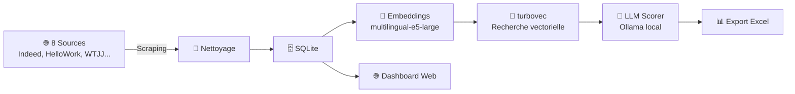

# 🔍 Alternance Search — Super Agregator

[](https://www.python.org/downloads/)
[](LICENSE)
[]()

**Système plug-and-play de recherche sémantique et scoring intelligent d'offres d'alternance.**

Scrape 8 sources françaises, indexe avec des embeddings multilingues 1024-dim, re-rank par LLM local, dashboard web et export Excel. Zéro infrastructure externe — tout tourne en local.



---

## 🚀 Quick Start

```bash
git clone https://github.com/<user>/<repo>.git
cd <repo>/alternance-search

# Windows
.\make.bat setup
.\make.bat serve

# Linux / macOS
make setup
make serve
```

→ **Dashboard** : http://localhost:8000  
→ **API Docs** : http://localhost:8000/docs

**Prérequis** : Python 3.10+, 4 Go RAM, ~3 Go disque.

---

## ✨ Fonctionnalités

- **Scraping multi-source** — Indeed, HelloWork, iQuesta, Welcome to the Jungle, La Bonne Alternance, Jeunes d'Avenirs, Moodle ENSEA, JobTeaser ENSEA
- **Embeddings multilingues** — `intfloat/multilingual-e5-large` (1024-dim), optimisé français
- **Recherche vectorielle locale** — turbovec (Rust, compression 4-bit), pas de serveur externe
- **Scoring LLM optionnel** — Ollama local ou API OpenAI, ranking hybride (60% embedding + 40% LLM)
- **Dashboard web** — FastAPI + Jinja2, pilotage complet
- **Export Excel** — pandas + openpyxl, multi-feuilles formatées
- **Configuration centralisée** — pydantic-settings, `.env`, variables d'environnement
- **Multi-plateforme** — Windows, Linux, macOS

---

## 📁 Structure du repo

```
.
├── alternance-search/          # ← Le projet principal
│   ├── src/                    # Code source
│   │   ├── scraper/            #   Scrapers (Playwright + BS4)
│   │   ├── normalizer/         #   Nettoyage des offres
│   │   ├── store/              #   SQLite (SQLAlchemy)
│   │   ├── embeddings/         #   sentence-transformers
│   │   ├── search/             #   Indexation & recherche turbovec
│   │   ├── scoring/            #   Scoring LLM + ranking hybride
│   │   ├── export/             #   Export Excel
│   │   └── webapp/             #   Dashboard FastAPI
│   ├── scripts/                # CLI (click + rich)
│   ├── config/                 # Configuration (pydantic-settings)
│   ├── auth/                   # Sessions Playwright
│   ├── data/                   # SQLite + index (généré)
│   ├── Makefile / make.bat     # Commandes unifiées
│   ├── .env.example            # Template de configuration
│   └── README.md               # Documentation détaillée
│
├── turbovec-0.8.1/             # Librairie vectorielle Rust (compilée localement)
├── launch.bat                  # Lancement rapide Windows
└── launch.ps1                  # Lancement rapide PowerShell
```

---

## 🔧 Commandes

```bash
cd alternance-search

make setup                          # Installer tout
make serve                          # Dashboard → :8000
make scrape                         # Scraper toutes les sources
make pipeline                       # Pipeline complet
make index                          # Reconstruire l'index
make search "data science Paris"    # Rechercher + export
make auth                           # Auth Playwright (CAS/OpenID)
make test                           # Tests
make clean                          # Nettoyer
```

---

## ⚙️ Configuration rapide

```bash
cd alternance-search
cp .env.example .env
# Éditer .env si besoin — les valeurs par défaut sont adaptées au développement local
```

Principales variables :

| Variable | Défaut | Rôle |
|----------|--------|------|
| `EMBED_MODEL_NAME` | `intfloat/multilingual-e5-large` | Modèle d'embeddings |
| `SCORER_PROVIDER` | `ollama` | LLM (`ollama` ou `openai`) |
| `SCORER_MODEL` | `qwen2.5:7b` | Modèle LLM |
| `BROWSER_EXECUTABLE_PATH` | *(auto)* | Navigateur Chromium |
| `DB_URL` | `sqlite:///data/offres.db` | Base SQLite |

---

## 🤖 Scoring LLM (optionnel)

Sans LLM, la recherche vectorielle fonctionne déjà très bien :

```bash
python -m scripts.search --query "data science Paris" --k 20 --export
```

Avec LLM local (Ollama) :

```bash
ollama pull qwen2.5:7b
python -m scripts.search --query "data science" --k 20 --score --export
```

Le LLM évalue chaque offre sur 3 axes (/100) et fournit explications, forces et faiblesses.

---

## 🛠️ Stack technique

| Couche | Technologie |
|--------|-------------|
| Scraping | Playwright, BeautifulSoup4, requests |
| Base de données | SQLite + SQLAlchemy ORM |
| Embeddings | sentence-transformers (`multilingual-e5-large`) |
| Recherche vectorielle | turbovec (Rust, IdMapIndex, compression 4-bit) |
| Scoring LLM | Ollama / OpenAI-compatible API |
| Dashboard | FastAPI + Jinja2 + uvicorn |
| Export | pandas + openpyxl |
| Configuration | pydantic-settings |
| CLI | click + rich |

---

## 📄 Licence

MIT — voir [LICENSE](LICENSE) pour plus de détails.
