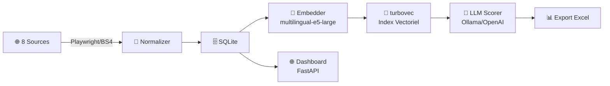

# 🔍 Alternance Search — Recherche & Ranking Sémantique d'Offres d'Alternance

[](https://www.python.org/downloads/)
[](LICENSE)

Système plug-and-play de collecte, indexation, recherche sémantique et scoring LLM d'offres d'alternance en France.



---

## 🚀 Quick Start

```bash
# 1. Cloner
git clone <repo-url>
cd alternance-search

# 2. Setup automatique
# Windows :
.\make.bat setup
# Linux/macOS :
make setup

# 3. Dashboard → http://localhost:8000
.\make.bat serve   # ou make serve
```

**Prérequis** : Python 3.10+, 4 Go RAM, ~3 Go disque (modèle d'embeddings).

---

## 📋 Commandes

| `make` / `make.bat` | Description |
|----------------------|-------------|
| `setup` | Installe tout (venv, pip, turbovec, Playwright, DB) |
| `serve` | Dashboard → http://localhost:8000 |
| `scrape` | Scrape toutes les sources |
| `pipeline` | Pipeline complet scrape → normalise → stocke |
| `index` | Reconstruit l'index vectoriel turbovec |
| `search "query"` | Recherche + scoring + export Excel |
| `auth` | Sauvegarde l'auth Playwright (CAS/OpenID) |
| `db-demo` | Insère 5 offres de démonstration |
| `test` | Lance les tests |
| `clean` | Nettoie données, index, exports |

---

## 🏗️ Architecture

```
alternance-search/
├── config/settings.py       # Configuration centralisée (pydantic-settings)
├── src/
│   ├── scraper/             # Scrapers Playwright/BS4
│   │   └── plugins/         # 8 sources : indeed, hellowork, iquesta, wttj...
│   ├── normalizer/          # Nettoyage & normalisation
│   ├── store/               # SQLite (SQLAlchemy ORM)
│   ├── embeddings/          # sentence-transformers (multilingual-e5-large)
│   ├── search/              # Indexation & recherche turbovec
│   ├── scoring/             # Scoring LLM & ranking hybride
│   ├── export/              # Export Excel (pandas + openpyxl)
│   └── webapp/              # Dashboard FastAPI + Jinja2
├── scripts/                 # CLI (click + rich)
├── data/                    # SQLite + index (généré, .gitignored)
├── auth/                    # Sessions Playwright (.gitignored)
├── Makefile                 # Linux/macOS
├── make.bat                 # Windows
└── launch.sh / launch.bat   # Lancement dashboard
```

### Composants

| Composant | Technologie | Rôle |
|-----------|-------------|------|
| Scraping | Playwright + BS4 | 8 sources : Indeed, HelloWork, iQuesta, WTJJ, Moodle ENSEA, JobTeaser, La Bonne Alternance, Jeunes d'Avenirs |
| Base | SQLite + SQLAlchemy | Stockage avec déduplication (source, source_id) |
| Embeddings | `intfloat/multilingual-e5-large` | 1024-dim, multilingue FR/EN, préfixes E5 |
| Recherche | turbovec (Rust, local) | Index 4-bit, ANN sans serveur |
| Scoring LLM | Ollama / OpenAI | Re-ranking avec explications |
| Dashboard | FastAPI + Jinja2 | Interface web |
| Export | pandas + openpyxl | Fichiers Excel |

---

## ⚙️ Configuration

```bash
cp .env.example .env   # puis éditez .env
```

| Variable | Défaut | Description |
|----------|--------|-------------|
| `EMBED_MODEL_NAME` | `intfloat/multilingual-e5-large` | Modèle d'embeddings |
| `EMBED_DEVICE` | `cpu` | Device (`cpu`, `cuda`) |
| `BROWSER_EXECUTABLE_PATH` | *(auto-détection)* | Chemin Chromium |
| `SCORER_PROVIDER` | `ollama` | LLM (`ollama`, `openai`) |
| `SCORER_MODEL` | `qwen2.5:7b` | Modèle LLM |
| `SCORER_BASE_URL` | `http://localhost:11434/v1` | API compatible OpenAI |

→ [`.env.example`](.env.example) pour la liste complète.

---

## 🌐 Sources

| Source | Auth | Statut |
|--------|------|--------|
| Indeed.fr | Aucune | ✅ |
| HelloWork | Aucune | ✅ |
| iQuesta | Aucune | ✅ |
| Welcome to the Jungle | Aucune | ✅ |
| La Bonne Alternance | Aucune | ✅ |
| Jeunes d'Avenirs | Aucune | ✅ |
| Moodle ENSEA | CAS 🔒 | ✅ |
| JobTeaser ENSEA | OpenID 🔒 | ✅ |

🔒 = Lancer `make auth` avant le premier scraping.

---

## 🔐 Authentification ENSEA

```bash
make auth                              # Moodle ENSEA (CAS)
python -m scripts.save_auth_jobteaser  # JobTeaser ENSEA (OpenID)
```

Les fichiers `auth/*_state.json` expirent. Relancer si erreur d'auth.

---

## 🤖 Scoring LLM (optionnel)

Le LLM est **optionnel** — la recherche par embedding seule fonctionne :

```bash
# Mode sans LLM (recommandé par défaut)
python -m scripts.search --query "data science Paris" --k 20 --export
```

Avec Ollama local :

```bash
ollama pull qwen2.5:7b
# Configurer .env : SCORER_PROVIDER=ollama SCORER_BASE_URL=http://localhost:11434/v1
python -m scripts.search --query "data science" --k 20 --score --export
```

Le ranking hybride combine 60% embedding + 40% LLM.

---

## 📊 Workflow

```bash
make scrape                           # Collecter
make index                            # Indexer
make search "développeur full-stack"  # Rechercher + export
make serve                            # Dashboard
```

---

## 🛠️ Développement

```bash
pip install -e ".[dev]"
ruff check src/ scripts/
mypy src/
pytest tests/ -v
```

---

## 🔧 Dépannage

| Problème | Solution |
|----------|----------|
| `turbovec` ne compile pas | Installer Rust : `curl --proto '=https' --tlsv1.2 -sSf https://sh.rustup.rs \| sh` |
| "Authentification CAS requise" | Relancer `make auth` |
| Chromium introuvable | `python -m playwright install chromium` |
| LLM ne répond pas | `curl http://localhost:11434/api/tags` ou utiliser `--no-score` |
| `ModuleNotFoundError: No module named 'src'` | Toujours lancer depuis `alternance-search/` avec `-m` |

---

## 📄 Licence

MIT
